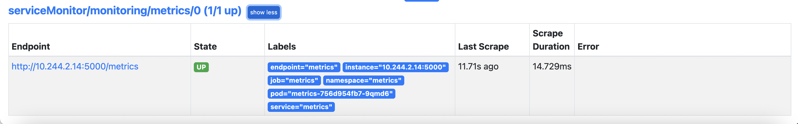

# prometheus-metrics-sample-app
A sample prometheus metrics python application

### Pre-requisites
1. [Docker](https://docs.docker.com/get-docker/)
2. [Kind](https://kind.sigs.k8s.io/docs/user/quick-start/#installation)
3. [Kubectl](https://kubernetes.io/docs/tasks/tools/#kubectl)
4. [Helm](https://helm.sh/docs/intro/install/)
5. [Kustomize](https://kubectl.docs.kubernetes.io/installation/kustomize/)

Note: If you are using Docker Desktop on Mac or Windows, please make sure the Docker VM is a minimum of 4 CPUs and 6GB Memory.
(This can be modified under the setting/preferences of Docker Desktop)

### Steps
1. Create a kubernetes cluster.
```
kind create cluster -f kind/config.yaml
```
2. Install the prometheus-operator using the kube-prometheus-stack helm chart.
```
helm repo add prometheus-community https://prometheus-community.github.io/helm-charts
helm update

helm install kube-prometheus-stack prometheus-community/kube-prometheus-stack --version 31.0.0 -n monitoring
```

This will install the prometheus-operator which inturn will create prometheus statefulset, grafana deployment and alertmanager statefulset and a few out of the box exporters in the monitoring namespace

```
prometheus-metrics-sample-app % kubectl get pods -n monitoring                                  
NAME                                                        READY   STATUS    RESTARTS   AGE
alertmanager-kube-prometheus-stack-alertmanager-0           2/2     Running   0          75s
kube-prometheus-stack-grafana-67f7cb9468-srjbs              3/3     Running   0          79s
kube-prometheus-stack-kube-state-metrics-7f56994f6c-9lp95   1/1     Running   0          79s
kube-prometheus-stack-operator-868bb97b5c-bntw5             1/1     Running   0          79s
kube-prometheus-stack-prometheus-node-exporter-7sgfd        1/1     Running   0          79s
kube-prometheus-stack-prometheus-node-exporter-bg8rg        1/1     Running   0          79s
kube-prometheus-stack-prometheus-node-exporter-h67xq        1/1     Running   0          79s
kube-prometheus-stack-prometheus-node-exporter-nd6jt        1/1     Running   0          79s
prometheus-kube-prometheus-stack-prometheus-0               2/2     Running   0          75s
```

3. Build the sample python metrics app
```
cd pythonapp

docker build -t metrics:v0.1 -f dockerfile-distroless .
```

4. Load the image into the Kubernetes nodes.
```
kind load docker-image metrics:v0.1 --name monitoring
```

5. Deploy the python application.
```
cd ../manifests

kubectl build . | kubectl create -f -
```

6. Monitor the metrics using prometheus. 
```
kubectl port-forward svc/prometheus-operated -n monitoring 9090
```
Access localhost:9090 using a browser.

Find the service monitor as a prometheus target.


